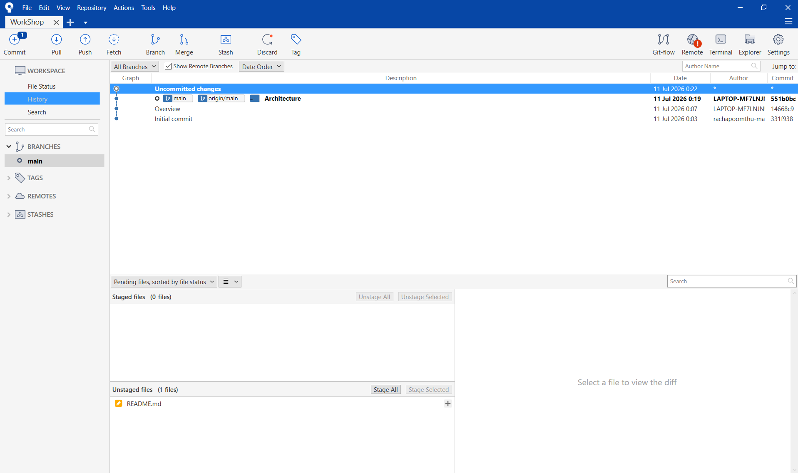

# Workshop
# ระบบร้านค้าออนไลน์ขายอุปกรณ์คอมพิวเตอร์

## ชื่อโครงงาน (Project Title)

**ภาษาไทย**
ระบบร้านค้าออนไลน์ขายอุปกรณ์คอมพิวเตอร์

**ภาษาอังกฤษ**
E-Commerce Platform for Computer Hardware and Gaming Gear

---

# หลักการและเหตุผล (Rationale)

ปัจจุบันความต้องการอุปกรณ์คอมพิวเตอร์และเกมมิ่งเกียร์เติบโตขึ้นอย่างมาก แต่ผู้ซื้อมักเจอปัญหาร้านค้าออนไลน์ที่ใช้งานยากและจัดหมวดหมู่ซับซ้อน คณะผู้จัดทำจึงพัฒนาระบบ E-commerce นี้ขึ้น เพื่อสร้างแพลตฟอร์มจำลองที่ซื้อขายง่าย ค้นหาสินค้าได้สะดวก และแยกหมวดหมู่อุปกรณ์ชัดเจน เพื่อตอบโจทย์พฤติกรรมของผู้บริโภคยุคดิจิทัลได้อย่างมีประสิทธิภาพ

---

# วัตถุประสงค์ของโครงงาน (Objectives)

1. เพื่อพัฒนาเว็บแอปพลิเคชันร้านค้าออนไลน์สำหรับจำหน่ายอุปกรณ์คอมพิวเตอร์และเกมมิ่งเกียร์ ที่ช่วยให้ผู้ใช้สามารถค้นหา เลือกซื้อ และสั่งซื้อสินค้าได้อย่างสะดวก

2. เพื่อพัฒนาระบบจัดการข้อมูลสินค้า ตะกร้าสินค้า และคำสั่งซื้อ ให้สามารถจัดเก็บและประมวลผลข้อมูลได้อย่างถูกต้องและมีประสิทธิภาพ

---

# สมาชิกในกลุ่ม (Group Information)

| รหัสนักศึกษา | ชื่อ-สกุล | หน้าที่ |
|--------------|------------------|------------------------------|
| 67144643 | สุรวุฒิ บุญยู้ | Project Manager / Leader Dev |
| 67150490 | เชษฐกิตติ์ สืบสุขสันติ | Software Developer & QA Tester |
| 67159224 | รัชภูมิ ธรรมประชา | Software Developer & UI Designer |
| 67159844 | ภูริภัทร ทองมวน | Software Developer & UI Designer |

---

# ขอบเขตของระบบ (System Scope)

## ผู้ใช้งาน (Actors)

- ลูกค้า (Customer)
- ผู้ดูแลร้านค้า (Admin)
- ผู้ดูแลระบบ (Administrator)

## ความสามารถหลักของระบบ (Main Functions)

1. การจัดการสมาชิก (Register / Login) 
2. การจัดการข้อมูลสินค้า 
3. การค้นหาและแสดงรายละเอียดสินค้า 
4. ระบบตะกร้าสินค้า (Shopping Cart) 
5. ระบบสั่งซื้อสินค้า (Order Management)
6. ระบบชำระเงิน (Simulation หรือ Mockup ได้) 
7. ระบบติดตามสถานะคำสั่งซื้อ 
8. ระบบจัดการสินค้าและคำสั่งซื้อสำหรับผู้ดูแลระบบ 
9. รายงานหรือ Dashboard สรุปขอมูลเบื้องตน

---

# เครื่องมือและเทคโนโลยีที่ใช้ (Tools & Technologies)

## Frontend

- HTML/CSS/JavaScript
- React
- Bootstrap

## Backend

- Node.js

## Database

- Local Storage

## Design Tool

- Figma

## Version Control

- Git
- GitHub

---

# แนวทางการพัฒนาตาม SDLC (System Development Life Cycle)

| ขั้นตอน (Phase) | รายละเอียดโดยย่อ (Brief Description) |
|-----------------|----------------------------------------|
| Planning | ประชุมเลือกหัวข้อ กำหนดขอบเขตระบบ และแบ่งงานในกลุ่ม |
| Analysis | รวบรวมข้อมูลสินค้าและวิเคราะห์ความต้องการหน้าจอของระบบ |
| Design | ออกแบบ UI/UX ด้วย Figma และออกแบบโครงสร้างฐานข้อมูล (Database Schema) |
| Development | พัฒนา Frontend ด้วย React และพัฒนา Backend ด้วย Node.js เชื่อมต่อกับ MySQL |
| Testing | ทดสอบระบบแบบ |
| Deployment | นำระบบขึ้นระบบจำลองหรือคลาวด์เซิร์ฟเวอร์ |
| Maintenance | ตรวจสอบและแก้ไขข้อผิดพลาด |

---

# แนวทางการทดสอบระบบ (Testing Approach)

## ประเภทการทดสอบ (Test Types)

- Functional Testing
- User Acceptance Testing (UAT)

## เครื่องมือที่ใช้ (Tools)

- Manual Testing

## รายละเอียดการทดสอบ (Testing Details)

*** ไม่มีผลการใช้เครื่องมือทดสอบอัตโนมัติหรือมีการจัดทำรายงานผลการทดสอบอย่างเป็นทางการ ***

การทดสอบการทำงานของระบบด้วยตนเองตามฟังก์ชันที่พัฒนาขึ้น พร้อมบันทึกการทำงานต่อฟีเจอร์ โดยวัดเทียบผลการทดสอบผลลัพธ์ที่คาดหวังและผลลัพธ์ที่เกิดขึ้นจริง เพื่อแสดงให้เห็นว่าระบบทำงานได้ตรงตามวัตถุประสงค์ที่กำหนดไว้

---

# ผลลัพธ์ที่คาดว่าจะได้รับ (Expected Outcomes)

1. ระบบสามารถแสดงรายการสินค้าและราคาอุปกรณ์คอมพิวเตอร์แยกตามหมวดหมู่ได้อย่างถูกต้อง

2. ระบบสามารถบันทึก ปรับปรุง และคำนวณราคาสินค้าในตะกร้าของลูกค้าได้แบบเรียลไทม์

3. ระบบสามารถจำลองการออกใบสรุปยอดเงินและประวัติการสั่งซื้อหลังยืนยันขั้นตอนชำระเงิน

4. ข้อมูลการเลือกซื้อสินค้าถูกจัดเก็บใน Local Storage ได้อย่างถูกต้องและปลอดภัยกับผู้ใช้

---

# แผนการดำเนินงาน 4 สัปดาห์ (Work Plan: 4 Weeks)

| สัปดาห์ | กิจกรรม | รายละเอียดโดยย่อ |
|---------|-------------------------------|--------------------------------------------------------------|
| 1 | วิเคราะห์และออกแบบระบบ (Analysis & Design) | เก็บรวบรวมความต้องการของระบบ, ออกแบบ UI/UX ด้วย Figma และออกแบบโครงสร้างฐานข้อมูล (Database Schema) ใน Local Storage ได้อย่างถูกต้องและปลอดภัยกับผู้ใช้ |
| 2 | พัฒนา Frontend (Frontend Development) | เขียนโค้ดส่วนหน้าบ้านด้วย React เพื่อสร้างหน้าจอแสดงสินค้า หมวดหมู่ ตะกร้าสินค้า และหน้าจำลองสั่งซื้อ |
| 3 | พัฒนา Backend และฐานข้อมูล (Backend & Database Development) | พัฒนาส่วนหลังบ้านด้วย Node.js และสร้างฐานข้อมูล MySQL เพื่อใช้จัดการและเชื่อมต่อข้อมูลสินค้าและคำสั่งซื้อ |
| 4 | ทดสอบระบบและนำเสนอผลงาน (Testing & Presentation) | ทำการทดสอบระบบแบบ Manual Testing และทำ UAT ตรวจสอบความถูกต้อง พร้อมจัดทำสรุปเพื่อนำเสนอผลงาน |
---

## SourceTree และ Commit History
