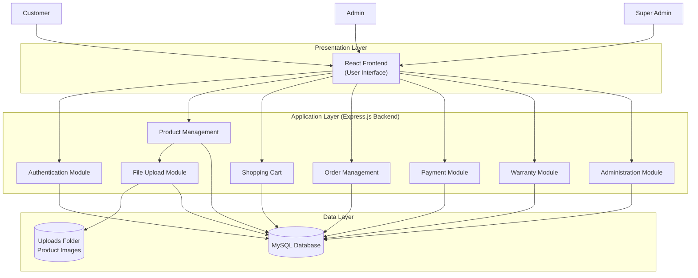
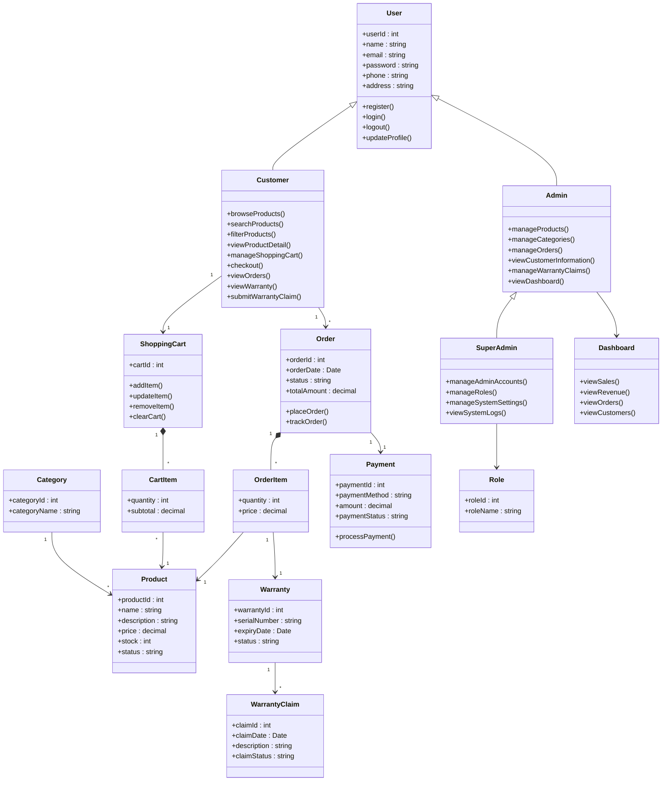
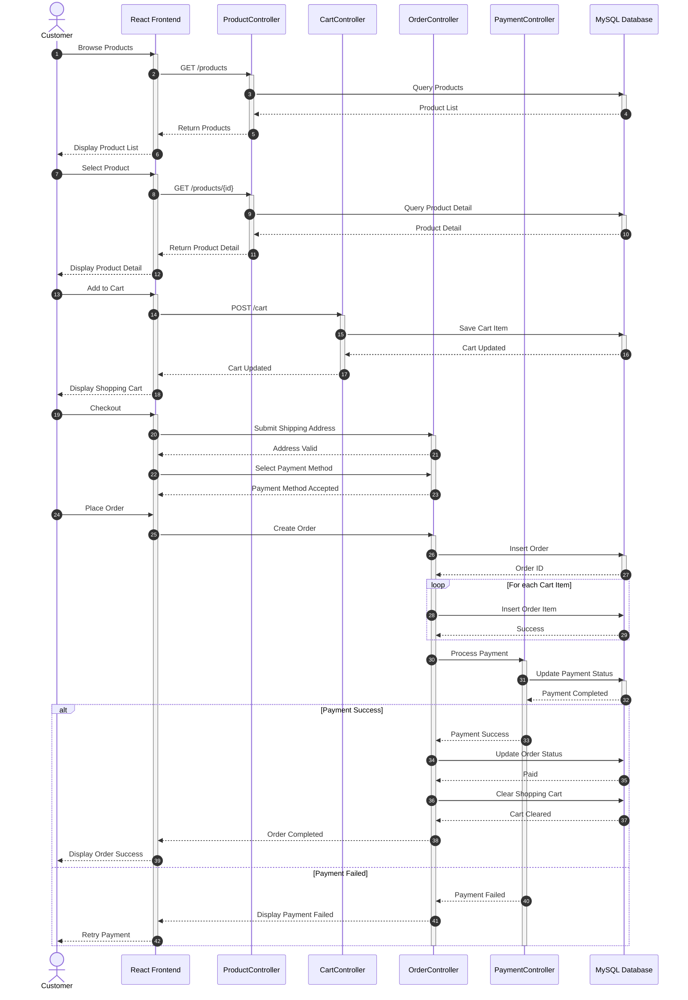

# E-Commerce Platform for Computer Hardware and Gaming Gears

**สมาชิก**
- 67144643 สุรวุฒิ บุญยู้ ( Leader Dev & Project Manager )
- 67150490 เชษฐกิตติ์ สืบสุขสันติ ( Sorfware Developer & Qa Tester )
- 67159224 รัชภูมิ ธรรมประชา ( Software developer & Ui Designer )
- 67159844 ภูริภัทร ทองมวน ( Software developer & Ui Designer )

## หลักการและเหตุผล

- ปัจจุบันความต้องการอุปกรณ์คอมพิวเตอร์และเกมมิ่งเกียร์เติบโตขึ้นอย่างมาก แต่ผู้ซื้อมักเจอปัญหาร้านค้าออนไลน์ที่ใช้งานยากและจัดหมวดหมู่ซับซ้อน คณะผู้จัดทำจึงพัฒนาระบบ    E-commerce นี้ขึ้น เพื่อสร้างแพลตฟอร์มจำลองที่ซื้อขายง่าย ค้นหาสินค้าได้สะดวก และแยกหมวดหมู่อุปกรณ์ชัดเจน เพื่อตอบโจทย์พฤติกรรมของผู้บริโภคยุคดิจิทัลได้อย่างมีประสิทธิภาพ

## วัตถุประสงค์ของโครงงาน

- เพื่อพัฒนาเว็บแอปพลิเคชัน E-commerce สำหรับซื้อขายอุปกรณ์คอมพิวเตอร์ที่ค้นหาง่ายและแยกหมวดหมู่ชัดเจน
- เพื่อพัฒนาระบบตะกร้าสินค้าที่สามารถคำนวณเงิน ปรับเพิ่ม/ลดจำนวน และสรุปยอดสั่งซื้อได้อย่างถูกต้อง

## ขอบเขตของระบบ

**ผู้ใช้งาน**
- ลูกค้า
- ผู้ดูแลระบบ
- ผู้จัดการ

## ความสามารถของระบบ

**ลูกค้า (Customer)**
- สามารถสมัครสมาชิก เข้าสู่ระบบ และออกจากระบบได้
- สามารถค้นหาและดูรายละเอียดสินค้าตามหมวดหมู่ได้
- สามารถเพิ่มสินค้า แก้ไขจำนวน หรือลบสินค้าออกจากตะกร้าสินค้าได้
- สามารถสั่งซื้อสินค้าและชำระเงินผ่านระบบจำลอง (Simulation / Mock Payment) ได้
- สามารถติดตามสถานะคำสั่งซื้อและตรวจสอบประวัติการสั่งซื้อของตนเองได้

**ผู้ดูแลระบบ (Admin)**
- สามารถจัดการข้อมูลสินค้า ได้แก่ เพิ่ม แก้ไข ลบ และอัปเดตข้อมูลสินค้าได้
- สามารถจัดการข้อมูลหมวดหมู่สินค้าได้
- สามารถจัดการคำสั่งซื้อของลูกค้า และอัปเดตสถานะคำสั่งซื้อได้
- สามารถดูรายงานและ Dashboard สรุปข้อมูลเบื้องต้นของระบบได้

**ผู้จัดการระบบ (Super Admin)**
- สามารถจัดการข้อมูลสมาชิกทั้งหมด รวมถึงเพิ่ม แก้ไข ระงับ และลบบัญชีผู้ใช้งานได้
- สามารถจัดการสิทธิ์การใช้งานของผู้ดูแลระบบ (Admin) และผู้ใช้งาน (Customer) ได้
- สามารถเข้าถึงและใช้งานทุกความสามารถของผู้ดูแลระบบได้
- สามารถดูรายงานและ Dashboard ภาพรวมของระบบ เพื่อใช้ในการบริหารจัดการร้านค้าได้

## แนวทางการพัฒนาตาม SDLC

1. ประชุมเลือกหัวข้อ กำหนดขอบเขตระบบ และแบ่งงานในกลุ่ม
2. รวบรวมข้อมูลสินค้าและวิเคราะห์ความต้องการหน้าจอของระบบ
3. ออกแบบ UI/UX ด้วย Figma และออกแบบโครงสร้างฐานข้อมูล (Database Schema)
4. พัฒนา Frontend ด้วย React และพัฒนา Backend ด้วย Node.js เชื่อมต่อกับ MySQL
5. ทดสอบระบบแบบ
6. นำระบบขึ้นระบบจำลองหรือคลาวด์เซิร์ฟเวอร์
7. ตรวจสอบและแก้ไขข้อผิดพลาด

## เครื่องมือแล้วเทคโนโลยีที่ใช้

**Frontend**
- HTML/CSS/Javascript
- React
- Boostrap

**Backend**
- Node.js

**Database**
- Local Storage

**Design Tool**
- Figma

**Version Control**
- Github

## แนวทางในการทดสอบระบบ

**ประเภทการทดสอบ**
- User Acceptance Testing (UAT)
  
## ผลลัพท์ที่คาดว่าจะได้รับ

1. ระบบสามารถแสดงรายการสินค้าและราคาอุปกรณ์คอมพิวเตอร์แยกตามหมวดหมู่ได้อย่างถูกต้อง
2. ระบบสามารถบันทึก ปรับปรุง และคำนวณราคาสินค้าในตะกร้าของลูกค้าได้แบบเรียลไทม์
3. ระบบสามารถจำลองการออกใบสรุปยอดเงินและประวัติการสั่งซื้อหลังสิ้นสุดขั้นตอนชำระเงิน
4. ข้อมูลการเลือกซื้อสินค้าถูกจัดเก็บใน Local Storage ได้อย่างถูกต้องและปลอดภัยฝั่งผู้ใช้

## แผนการดำเนินงาน

1. เก็บรวบรวมความต้องการของระบบ, ออกแบบ UI/UX ด้วย Figma และออกแบบโครงสร้างฐานข้อมูล (Database Schema)น Local Storage ได้อย่างถูกต้องและปลอดภัยฝั่งผู้ใช้
2. เขียนโค้ดส่วนหน้าบ้านด้วย React เพื่อสร้างหน้าจอแสดงสินค้า หมวดหมู่ ตะกร้าสินค้า และหน้าจำลองสั่งซื้อ
3. พัฒนาส่วนหลังบ้านด้วย Node.js และสร้างฐานข้อมูล MySQL เพื่อใช้จัดการและเชื่อมต่อข้อมูลสินค้าและคำสั่งซื้อ
4. ทำการทดสอบระบบแบบ Manual Testing และทำ UAT ตรวจสอบความถูกต้อง พร้อมจัดทำสรุปเพื่อนำเสนอผลงาน

## Screenshot SourceTree 

## System Architecture

## 1) แผนภาพกรณีการใช้งาน (Use Case Diagram)

หน้าที่ของแผนภาพ:
- แสดงขอบเขตของระบบ TechPulse ให้เห็นชัดว่าใครทำอะไรได้บ้าง
- ใช้ยืนยันขอบเขตงานกับสมาชิกในทีมและผู้สอน

ความสำคัญต่อการพัฒนาระบบ:
- ลดความเสี่ยงการตกหล่นฟังก์ชันสำคัญ เช่น ตรวจสิทธิ์และงานหลังบ้าน
- ใช้เป็นฐานในการกำหนดเส้นทางหน้าเว็บและสิทธิ์การเรียก API ตามบทบาท

## 2) แผนภาพคลาส (Class Diagram)

หมายเหตุ: แผนภาพนี้อ้างอิงชื่อโครงสร้างข้อมูลจริงในฐานข้อมูลของโครงการ

หน้าที่ของแผนภาพ:
- แสดงโครงสร้างข้อมูลหลักและความสัมพันธ์ระหว่างเอนทิตีในระบบ
- ใช้อ้างอิงร่วมกันระหว่างการออกแบบฐานข้อมูลและการพัฒนาโมเดล

ความสำคัญต่อการพัฒนาระบบ:
- ลดความกำกวมของข้อมูล เช่น ความสัมพันธ์ Order กับ OrderItem และ Payment
- ป้องกันการออกแบบซ้ำซ้อน ทำให้พัฒนา Controller และ Service ได้สอดคล้องกัน

## 3) แผนภาพลำดับงาน (Sequence Diagram)

กรณีศึกษา: ลำดับการทำงานของการสั่งซื้อและการชำระเงินในระบบจริง

หน้าที่ของแผนภาพ:
- แสดงลำดับการเรียกใช้งานจริงจากผู้ใช้ไปจนถึงฐานข้อมูล
- ช่วยให้ทีมเห็นจุดที่ต้องมีการตรวจสอบสิทธิ์ ตรวจสต็อก และควบคุมธุรกรรม

ความสำคัญต่อการพัฒนาระบบ:
- ทำให้มองเห็นจุดเสี่ยงด้านความถูกต้องของข้อมูล เช่น การตัดสต็อกซ้ำ
- ใช้ระบุจุดคอขวดที่ทำให้ระบบช้าในช่วงผู้ใช้หนาแน่น
