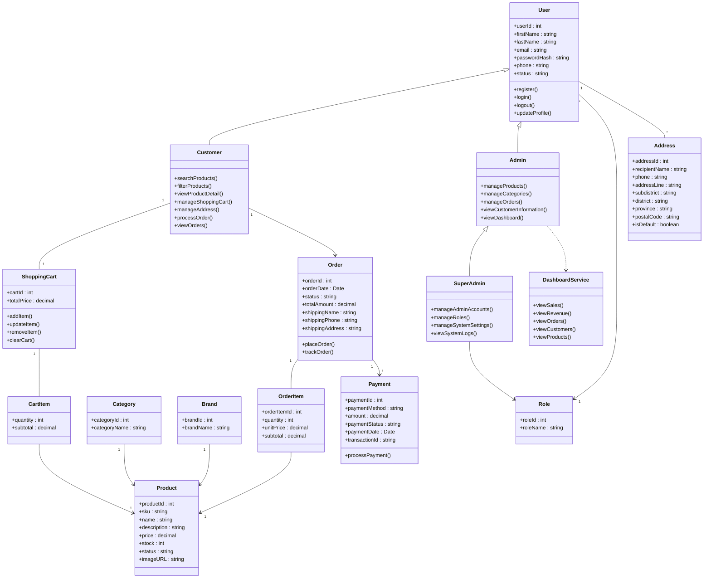

# E-Commerce Platform for Computer Hardware and Gaming Gears

**สมาชิก**
- 67144643 สุรวุฒิ บุญยู้ ( Leader Dev & Project Manager )
- 67150490 เชษฐกิตติ์ สืบสุขสันติ ( Sorfware Developer & Qa Tester )
- 67159224 รัชภูมิ ธรรมประชา ( Software developer & Ui Designer )
- 67159844 ภูริภัทร ทองมวน ( Software developer & Ui Designer )

## หลักการและเหตุผล

- ปัจจุบันความต้องการอุปกรณ์คอมพิวเตอร์และเกมมิ่งเกียร์เติบโตขึ้นอย่างมาก แต่ผู้ซื้อมักเจอปัญหาร้านค้าออนไลน์ที่ใช้งานยากและจัดหมวดหมู่ซับซ้อน คณะผู้จัดทำจึงพัฒนาระบบ    E-commerce นี้ขึ้น เพื่อสร้างแพลตฟอร์มจำลองที่ซื้อขายง่าย ค้นหาสินค้าได้สะดวก และแยกหมวดหมู่อุปกรณ์ชัดเจน เพื่อตอบโจทย์พฤติกรรมของผู้บริโภคยุคดิจิทัลได้อย่างมีประสิทธิภาพ

## วัตถุประสงค์ของโครงงาน

- เพื่อพัฒนาเว็บแอปพลิเคชัน E-commerce สำหรับจำหน่ายอุปกรณ์คอมพิวเตอร์
- เพื่อพัฒนาระบบจัดการสินค้าและหมวดหมู่สินค้า
- เพื่อพัฒนาระบบตะกร้าสินค้าและการสั่งซื้อที่สามารถคำนวณยอดชำระได้อย่างถูกต้อง
- เพื่อพัฒนาระบบจัดการข้อมูลสำหรับผู้ดูแลระบบ

## ขอบเขตของระบบ

**ผู้ใช้งาน**
- ลูกค้า
- ผู้ดูแลระบบ
- ผู้จัดการ

## ความสามารถของระบบ

**ลูกค้า (Customer)**
- สามารถสมัครสมาชิก เข้าสู่ระบบ และออกจากระบบได้
- สามารถค้นหาและดูรายละเอียดสินค้าตามหมวดหมู่ได้
- สามารถจัดการสินค้าในตะกร้าได้
- สามารถสั่งซื้อสินค้าและชำระเงินผ่านระบบจำลอง (Simulation / Mock Payment) ได้
- สามารถติดตามสถานะคำสั่งซื้อและตรวจสอบประวัติการสั่งซื้อของตนเองได้

**ผู้ดูแลระบบ (Admin)**
- สามารถจัดการข้อมูลสินค้า 
- สามารถจัดการข้อมูลหมวดหมู่สินค้าได้
- สามารถจัดการคำสั่งซื้อของลูกค้า และอัปเดตสถานะคำสั่งซื้อได้
- สามารถดูรายงานและ Dashboard สรุปข้อมูลเบื้องต้นของระบบได้

**ผู้จัดการระบบ (Super Admin)**
- สามารถจัดการข้อมูลสมาชิกทั้งหมด
- สามารถจัดการสิทธิ์การใช้งานของผู้ดูแลระบบ (Admin) และผู้ใช้งาน (Customer) ได้
- สามารถเข้าถึงและใช้งานทุกความสามารถของผู้ดูแลระบบได้
- สามารถดูรายงานและ Dashboard ภาพรวมของระบบ เพื่อใช้ในการบริหารจัดการร้านค้าได้

## แนวทางการพัฒนาตาม SDLC

1. ประชุมเลือกหัวข้อ กำหนดขอบเขตระบบ และแบ่งงานในกลุ่ม
2. รวบรวมข้อมูลสินค้าและวิเคราะห์ความต้องการหน้าจอของระบบ
3. ออกแบบ UI/UX ด้วย Figma และออกแบบโครงสร้างฐานข้อมูล (Database Schema)
4. พัฒนา Frontend ด้วย React และพัฒนา Backend ด้วย Node.js เชื่อมต่อกับ MySQL
5. ทดสอบระบบด้วย Manual Testing และ User Acceptance Testing (UAT)
6. ปรับปรุงและแก้ไขข้อผิดพลาดของระบบ
7. จัดทำเอกสารและสรุปผลการพัฒนา

## เครื่องมือและเทคโนโลยีที่ใช้

### Frontend
- Vite with React

### Backend
- Node.js
- Express.js

### Database
- MySQL

### Authentication
- JWT (JSON Web Token)
- bcrypt

### Design Tool
- Figma

### Version Control
- Git
- GitHub
- SourceTree

### Development Tool
- Visual Studio Code

## แนวทางในการทดสอบระบบ

**ประเภทการทดสอบ**
- Manual Testing
- User Acceptance Testing (UAT)

[กระบวนการทดสอบ UAT](uat_checklist.html)
ไม่วัดผลการใช้เครื่องมือทดสอบอัตโนมัติหรือมีการจัดทํารายงานผลการทดสอบอย่างเป็นทางการ
การทดสอบการทํางานของระบบด้วยตนเองตามฟังก์ชันทีพัฒนา พร้อมสาธิตการทํางานต่อผู ้สอน 
โดยอธิบายขั้นตอนการทดสอบผลลัพธ์ทีคาดหวังและผลลัพธ์ทีเกิดขึ้นจริง เพือแสดงให้เห็นว่าระบบทํางาน
ได้ถูกต้องตามวัตถุประสงค์ที่กําหนดไว้  

## ผลลัพท์ที่คาดว่าจะได้รับ

1. ระบบสามารถแสดงรายการสินค้าและราคาอุปกรณ์คอมพิวเตอร์แยกตามหมวดหมู่ได้อย่างถูกต้อง
2. ระบบสามารถบันทึก ปรับปรุง และคำนวณราคาสินค้าในตะกร้าของลูกค้าได้แบบเรียลไทม์
3. ระบบสามารถจำลองการออกใบสรุปยอดเงินและประวัติการสั่งซื้อหลังสิ้นสุดขั้นตอนชำระเงิน
4. ข้อมูลการเลือกซื้อสินค้าถูกจัดเก็บใน Local Storage ได้อย่างถูกต้องและปลอดภัยฝั่งผู้ใช้

## แผนการดำเนินงาน

1. เก็บรวบรวมความต้องการของระบบ, ออกแบบ UI/UX ด้วย Figma และออกแบบโครงสร้างฐานข้อมูล (Database Schema)น Local Storage ได้อย่างถูกต้องและปลอดภัยฝั่งผู้ใช้
2. เขียนโค้ดส่วนหน้าบ้านด้วย React เพื่อสร้างหน้าจอแสดงสินค้า หมวดหมู่ ตะกร้าสินค้า และหน้าจำลองสั่งซื้อ
3. พัฒนาส่วนหลังบ้านด้วย Node.js และสร้างฐานข้อมูล MySQL เพื่อใช้จัดการและเชื่อมต่อข้อมูลสินค้าและคำสั่งซื้อ
4. ทำการทดสอบระบบแบบ Manual Testing และทำ UAT ตรวจสอบความถูกต้อง พร้อมจัดทำสรุปเพื่อนำเสนอผลงาน

## System Architecture

flowchart TB
subgraph Users
Customer["Customer"]
Admin["Store Administrator"]
SuperAdmin["System Administrator"]
end
subgraph Presentation_Layer["Presentation Layer"]
React["React Web Application React Router"]
end
subgraph Application_Layer["Application Layer"]
Express["Node.js + Express REST API"]
Auth["Authentication"]
Product["Product Management"]
Search["Search Module"]
Cart["Shopping Cart"]
Order["Order Management"]
Payment["Mock Payment"]
AdminModule["Administration Module"]
end
subgraph Data_Layer["Data Layer"]
Upload["Local Image Storage"]
DB["MySQL Database"]
end
Customer --> React
Admin --> React
SuperAdmin --> React
React --> Express
Express --> Auth
Express --> Product
Express --> Search
Express --> Cart
Express --> Order
Express --> Payment
Express --> AdminModule
Product --> Upload
Auth --> DB
Product --> DB
Search --> DB
Cart --> DB
Order --> DB
Payment --> DB
AdminModule --> DB

## Class Diagram

## Screenshot SourceTree 

