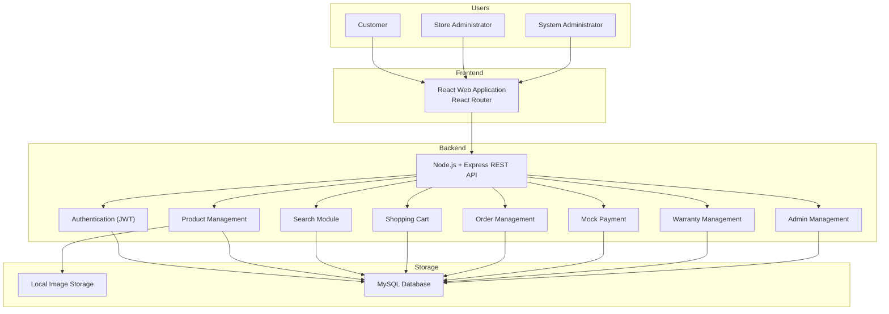

# System Architecture

## Overview

```mermaid
flowchart TB

    subgraph Users
        Customer["Customer"]
        Admin["Store Administrator"]
        SuperAdmin["System Administrator"]
    end

    subgraph Frontend
        React["React Web Application<br/>React Router"]
    end

    subgraph Backend
        Express["Node.js + Express REST API"]

        Auth["Authentication (JWT)"]
        Product["Product Management"]
        Search["Search Module"]
        Cart["Shopping Cart"]
        Order["Order Management"]
        Payment["Mock Payment"]
        Warranty["Warranty Management"]
        AdminModule["Admin Management"]
    end

    subgraph Storage
        Upload["Local Image Storage"]
        DB["MySQL Database"]
    end

    Customer --> React
    Admin --> React
    SuperAdmin --> React

    React --> Express

    Express --> Auth
    Express --> Product
    Express --> Search
    Express --> Cart
    Express --> Order
    Express --> Payment
    Express --> Warranty
    Express --> AdminModule

    Product --> Upload

    Auth --> DB
    Product --> DB
    Search --> DB
    Cart --> DB
    Order --> DB
    Payment --> DB
    Warranty --> DB
    AdminModule --> DB
```