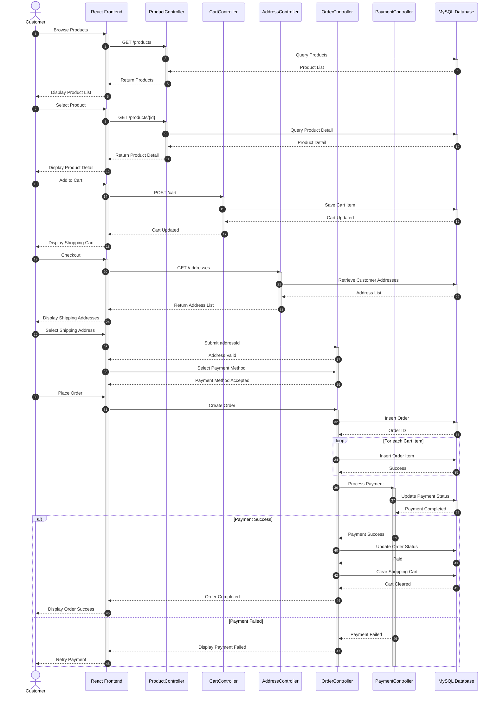
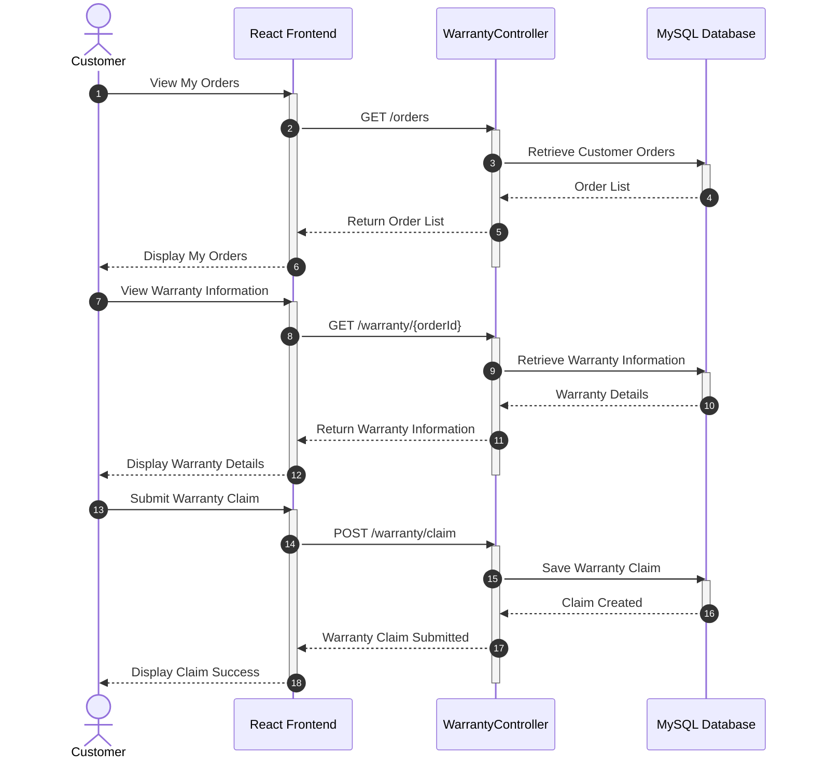
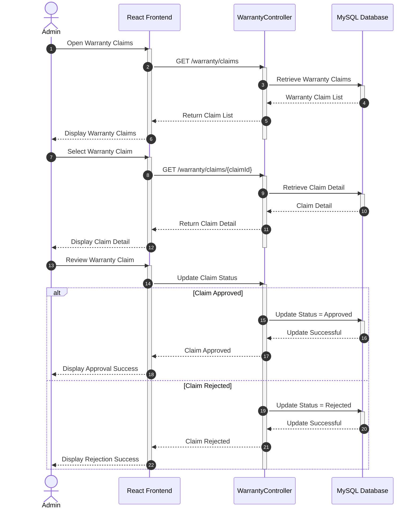
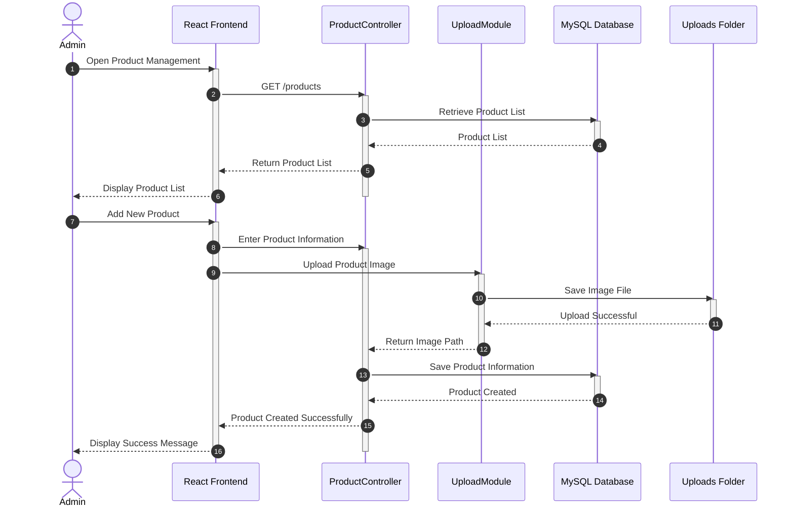
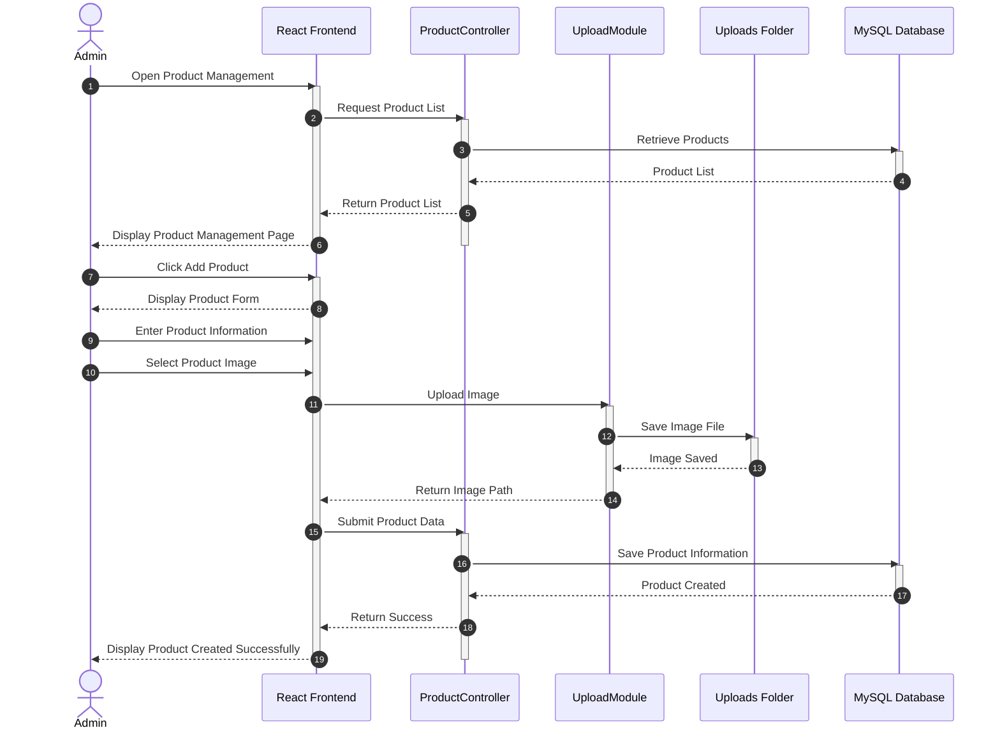

## Customer Purchase Flow

```mermaid
sequenceDiagram

autonumber

actor Customer

participant Frontend as React Frontend
participant ProductController
participant CartController
participant AddressController
participant OrderController
participant PaymentController
participant DB as MySQL Database

%% ==========================
%% Browse Products
%% ==========================

Customer->>Frontend: Browse Products

activate Frontend

Frontend->>ProductController: GET /products

activate ProductController

ProductController->>DB: Query Products

activate DB

DB-->>ProductController: Product List

deactivate DB

ProductController-->>Frontend: Return Products

deactivate ProductController

Frontend-->>Customer: Display Product List

deactivate Frontend

%% ==========================
%% View Product Detail
%% ==========================

Customer->>Frontend: Select Product

activate Frontend

Frontend->>ProductController: GET /products/{id}

activate ProductController

ProductController->>DB: Query Product Detail

activate DB

DB-->>ProductController: Product Detail

deactivate DB

ProductController-->>Frontend: Return Product Detail

deactivate ProductController

Frontend-->>Customer: Display Product Detail

deactivate Frontend

%% ==========================
%% Add to Cart
%% ==========================

Customer->>Frontend: Add to Cart

activate Frontend

Frontend->>CartController: POST /cart

activate CartController

CartController->>DB: Save Cart Item

activate DB

DB-->>CartController: Cart Updated

deactivate DB

CartController-->>Frontend: Cart Updated

deactivate CartController

Frontend-->>Customer: Display Shopping Cart

deactivate Frontend

%% ==========================
%% Checkout
%% ==========================

Customer->>Frontend: Checkout

activate Frontend

Frontend->>AddressController: GET /addresses

activate AddressController

AddressController->>DB: Retrieve Customer Addresses

activate DB

DB-->>AddressController: Address List

deactivate DB

AddressController-->>Frontend: Return Address List

deactivate AddressController

Frontend-->>Customer: Display Shipping Addresses

Customer->>Frontend: Select Shipping Address

Frontend->>OrderController: Submit addressId

activate OrderController

OrderController-->>Frontend: Address Valid

Frontend->>OrderController: Select Payment Method

OrderController-->>Frontend: Payment Method Accepted

deactivate OrderController

%% ==========================
%% Place Order
%% ==========================

Customer->>Frontend: Place Order

Frontend->>OrderController: Create Order

activate OrderController

OrderController->>DB: Insert Order

activate DB

DB-->>OrderController: Order ID

deactivate DB

loop For each Cart Item

OrderController->>DB: Insert Order Item

DB-->>OrderController: Success

end

%% ==========================
%% Payment
%% ==========================

OrderController->>PaymentController: Process Payment

activate PaymentController

PaymentController->>DB: Update Payment Status

activate DB

DB-->>PaymentController: Payment Completed

deactivate DB

alt Payment Success

PaymentController-->>OrderController: Payment Success

OrderController->>DB: Update Order Status

DB-->>OrderController: Paid

OrderController->>DB: Clear Shopping Cart

DB-->>OrderController: Cart Cleared

OrderController-->>Frontend: Order Completed

Frontend-->>Customer: Display Order Success

else Payment Failed

PaymentController-->>OrderController: Payment Failed

OrderController-->>Frontend: Display Payment Failed

Frontend-->>Customer: Retry Payment

end

deactivate PaymentController

deactivate OrderController

deactivate Frontend

```

---

### Warranty Claim Flow (Customer)

```mermaid
sequenceDiagram

autonumber

actor Customer

participant Frontend as React Frontend
participant WarrantyController
participant DB as MySQL Database

%% ======================================
%% View Order History
%% ======================================

Customer->>Frontend: View My Orders

activate Frontend

Frontend->>WarrantyController: GET /orders

activate WarrantyController

WarrantyController->>DB: Retrieve Customer Orders

activate DB

DB-->>WarrantyController: Order List

deactivate DB

WarrantyController-->>Frontend: Return Order List

Frontend-->>Customer: Display My Orders

deactivate WarrantyController

deactivate Frontend

%% ======================================
%% View Warranty
%% ======================================

Customer->>Frontend: View Warranty Information

activate Frontend

Frontend->>WarrantyController: GET /warranty/{orderId}

activate WarrantyController

WarrantyController->>DB: Retrieve Warranty Information

activate DB

DB-->>WarrantyController: Warranty Details

deactivate DB

WarrantyController-->>Frontend: Return Warranty Information

Frontend-->>Customer: Display Warranty Details

deactivate WarrantyController

deactivate Frontend

%% ======================================
%% Submit Warranty Claim
%% ======================================

Customer->>Frontend: Submit Warranty Claim

activate Frontend

Frontend->>WarrantyController: POST /warranty/claim

activate WarrantyController

WarrantyController->>DB: Save Warranty Claim

activate DB

DB-->>WarrantyController: Claim Created

deactivate DB

WarrantyController-->>Frontend: Warranty Claim Submitted

Frontend-->>Customer: Display Claim Success

deactivate WarrantyController

deactivate Frontend
```

---

### Manage Warranty Claim Flow (Admin)

```mermaid
sequenceDiagram

autonumber

actor Admin

participant Frontend as React Frontend
participant WarrantyController
participant DB as MySQL Database

%% ======================================
%% View Warranty Claims
%% ======================================

Admin->>Frontend: Open Warranty Claims

activate Frontend

Frontend->>WarrantyController: GET /warranty/claims

activate WarrantyController

WarrantyController->>DB: Retrieve Warranty Claims

activate DB

DB-->>WarrantyController: Warranty Claim List

deactivate DB

WarrantyController-->>Frontend: Return Claim List

Frontend-->>Admin: Display Warranty Claims

deactivate WarrantyController

deactivate Frontend

%% ======================================
%% View Claim Detail
%% ======================================

Admin->>Frontend: Select Warranty Claim

activate Frontend

Frontend->>WarrantyController: GET /warranty/claims/{claimId}

activate WarrantyController

WarrantyController->>DB: Retrieve Claim Detail

activate DB

DB-->>WarrantyController: Claim Detail

deactivate DB

WarrantyController-->>Frontend: Return Claim Detail

Frontend-->>Admin: Display Claim Detail

deactivate WarrantyController

deactivate Frontend

%% ======================================
%% Review Warranty Claim
%% ======================================

Admin->>Frontend: Review Warranty Claim

activate Frontend

Frontend->>WarrantyController: Update Claim Status

activate WarrantyController

alt Claim Approved

WarrantyController->>DB: Update Status = Approved

activate DB

DB-->>WarrantyController: Update Successful

deactivate DB

WarrantyController-->>Frontend: Claim Approved

Frontend-->>Admin: Display Approval Success

else Claim Rejected

WarrantyController->>DB: Update Status = Rejected

activate DB

DB-->>WarrantyController: Update Successful

deactivate DB

WarrantyController-->>Frontend: Claim Rejected

Frontend-->>Admin: Display Rejection Success

end

deactivate WarrantyController

deactivate Frontend
```

---

### Admin Add Product Flow

```mermaid
sequenceDiagram

autonumber

actor Admin

participant Frontend as React Frontend
participant ProductController
participant UploadModule
participant DB as MySQL Database
participant Storage as Uploads Folder

%% ======================================
%% Open Product Management
%% ======================================

Admin->>Frontend: Open Product Management

activate Frontend

Frontend->>ProductController: GET /products

activate ProductController

ProductController->>DB: Retrieve Product List

activate DB

DB-->>ProductController: Product List

deactivate DB

ProductController-->>Frontend: Return Product List

Frontend-->>Admin: Display Product List

deactivate ProductController

deactivate Frontend

%% ======================================
%% Add New Product
%% ======================================

Admin->>Frontend: Add New Product

activate Frontend

Frontend->>ProductController: Enter Product Information

activate ProductController

%% ======================================
%% Upload Image
%% ======================================

Frontend->>UploadModule: Upload Product Image

activate UploadModule

UploadModule->>Storage: Save Image File

activate Storage

Storage-->>UploadModule: Upload Successful

deactivate Storage

UploadModule-->>ProductController: Return Image Path

deactivate UploadModule

%% ======================================
%% Save Product
%% ======================================

ProductController->>DB: Save Product Information

activate DB

DB-->>ProductController: Product Created

deactivate DB

ProductController-->>Frontend: Product Created Successfully

Frontend-->>Admin: Display Success Message

deactivate ProductController

deactivate Frontend
```

---

### Admin Manage Order Flow

```mermaid
sequenceDiagram

autonumber

actor Admin

participant Frontend as React Frontend
participant ProductController
participant UploadModule
participant Storage as Uploads Folder
participant DB as MySQL Database

%% ==========================================
%% Open Product Management
%% ==========================================

Admin->>Frontend: Open Product Management

activate Frontend

Frontend->>ProductController: Request Product List

activate ProductController

ProductController->>DB: Retrieve Products

activate DB

DB-->>ProductController: Product List

deactivate DB

ProductController-->>Frontend: Return Product List

Frontend-->>Admin: Display Product Management Page

deactivate ProductController

deactivate Frontend

%% ==========================================
%% Add New Product
%% ==========================================

Admin->>Frontend: Click Add Product

activate Frontend

Frontend-->>Admin: Display Product Form

Admin->>Frontend: Enter Product Information

%% ==========================================
%% Upload Image
%% ==========================================

Admin->>Frontend: Select Product Image

Frontend->>UploadModule: Upload Image

activate UploadModule

UploadModule->>Storage: Save Image File

activate Storage

Storage-->>UploadModule: Image Saved

deactivate Storage

UploadModule-->>Frontend: Return Image Path

deactivate UploadModule

%% ==========================================
%% Save Product
%% ==========================================

Frontend->>ProductController: Submit Product Data

activate ProductController

ProductController->>DB: Save Product Information

activate DB

DB-->>ProductController: Product Created

deactivate DB

ProductController-->>Frontend: Return Success

Frontend-->>Admin: Display Product Created Successfully

deactivate ProductController

deactivate Frontend
```