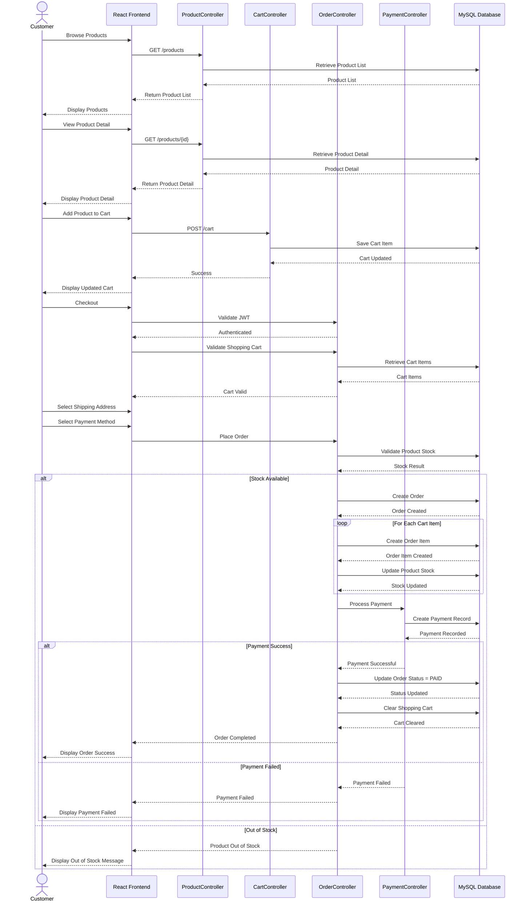
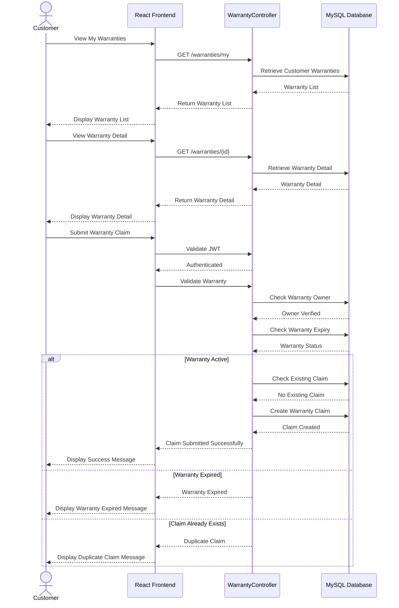
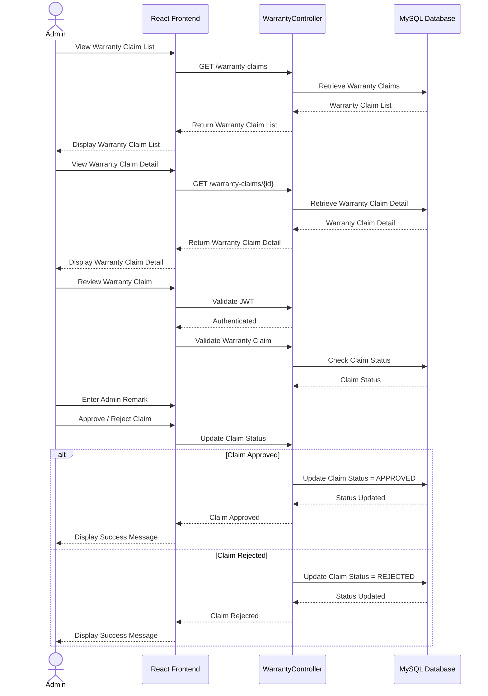
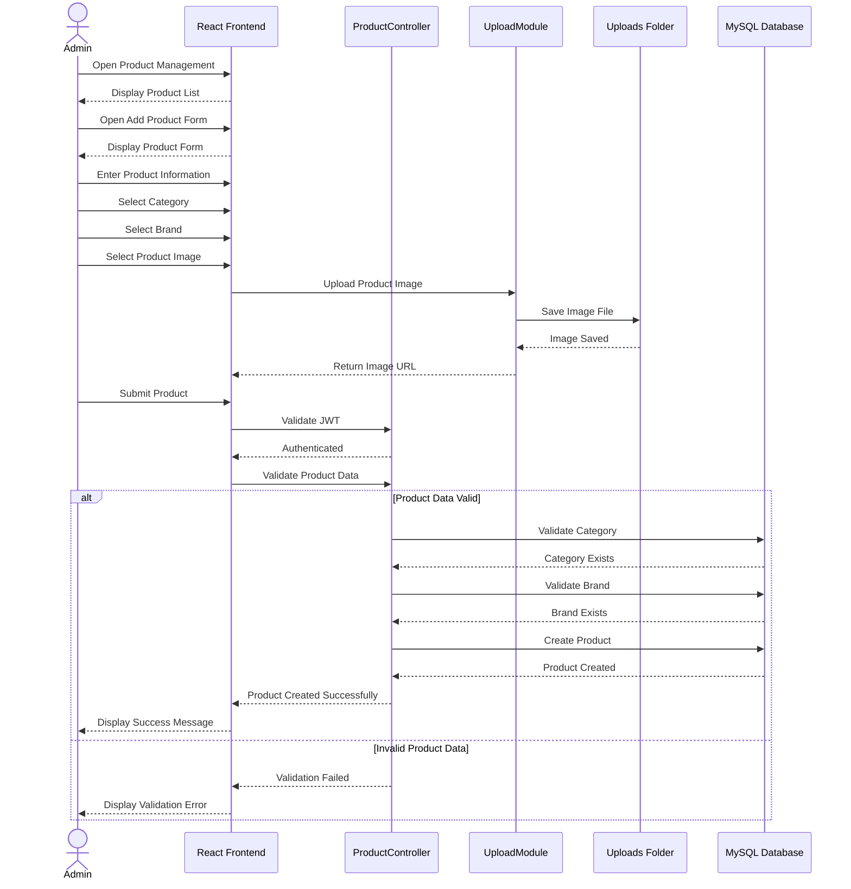
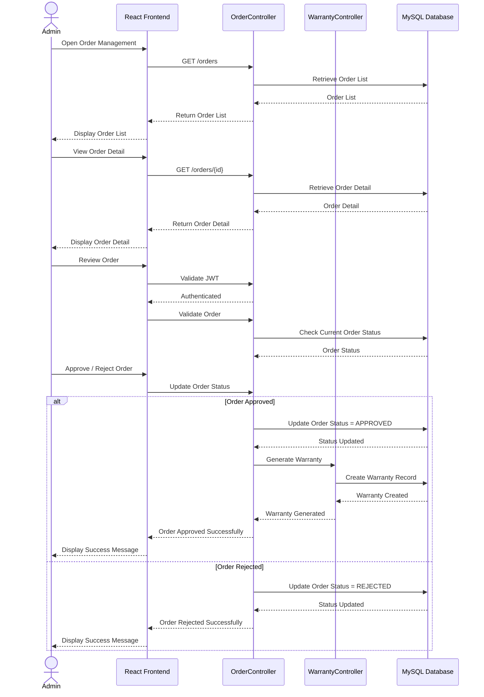

## Customer Purchase Flow

```mermaid
sequenceDiagram

actor Customer

participant FE as React Frontend
participant ProductController
participant CartController
participant OrderController
participant PaymentController
participant DB as MySQL Database

%% =====================================
%% Browse Products
%% =====================================

Customer->>FE: Browse Products
FE->>ProductController: GET /products
ProductController->>DB: Retrieve Product List
DB-->>ProductController: Product List
ProductController-->>FE: Return Product List
FE-->>Customer: Display Products

%% =====================================
%% View Product Detail
%% =====================================

Customer->>FE: View Product Detail
FE->>ProductController: GET /products/{id}
ProductController->>DB: Retrieve Product Detail
DB-->>ProductController: Product Detail
ProductController-->>FE: Return Product Detail
FE-->>Customer: Display Product Detail

%% =====================================
%% Add Product to Cart
%% =====================================

Customer->>FE: Add Product to Cart
FE->>CartController: POST /cart
CartController->>DB: Save Cart Item
DB-->>CartController: Cart Updated
CartController-->>FE: Success
FE-->>Customer: Display Updated Cart

%% =====================================
%% Checkout
%% =====================================

Customer->>FE: Checkout

FE->>OrderController: Validate JWT
OrderController-->>FE: Authenticated

FE->>OrderController: Validate Shopping Cart
OrderController->>DB: Retrieve Cart Items
DB-->>OrderController: Cart Items
OrderController-->>FE: Cart Valid

Customer->>FE: Select Shipping Address
Customer->>FE: Select Payment Method

FE->>OrderController: Place Order

%% =====================================
%% Validate Stock
%% =====================================

OrderController->>DB: Validate Product Stock
DB-->>OrderController: Stock Result

alt Stock Available

    OrderController->>DB: Create Order
    DB-->>OrderController: Order Created

    loop For Each Cart Item

        OrderController->>DB: Create Order Item
        DB-->>OrderController: Order Item Created

        OrderController->>DB: Update Product Stock
        DB-->>OrderController: Stock Updated

    end

    OrderController->>PaymentController: Process Payment

    PaymentController->>DB: Create Payment Record
    DB-->>PaymentController: Payment Recorded

    alt Payment Success

        PaymentController-->>OrderController: Payment Successful

        OrderController->>DB: Update Order Status = PAID
        DB-->>OrderController: Status Updated

        OrderController->>DB: Clear Shopping Cart
        DB-->>OrderController: Cart Cleared

        OrderController-->>FE: Order Completed
        FE-->>Customer: Display Order Success

    else Payment Failed

        PaymentController-->>OrderController: Payment Failed
        OrderController-->>FE: Payment Failed
        FE-->>Customer: Display Payment Failed

    end

else Out of Stock

    OrderController-->>FE: Product Out of Stock
    FE-->>Customer: Display Out of Stock Message

end
```

---

### Customer Warranty Claim Flow

```mermaid
sequenceDiagram

actor Customer

participant FE as React Frontend
participant WarrantyController
participant DB as MySQL Database

%% =====================================
%% View Warranty List
%% =====================================

Customer->>FE: View My Warranties
FE->>WarrantyController: GET /warranties/my

WarrantyController->>DB: Retrieve Customer Warranties
DB-->>WarrantyController: Warranty List

WarrantyController-->>FE: Return Warranty List
FE-->>Customer: Display Warranty List

%% =====================================
%% View Warranty Detail
%% =====================================

Customer->>FE: View Warranty Detail

FE->>WarrantyController: GET /warranties/{id}

WarrantyController->>DB: Retrieve Warranty Detail
DB-->>WarrantyController: Warranty Detail

WarrantyController-->>FE: Return Warranty Detail
FE-->>Customer: Display Warranty Detail

%% =====================================
%% Submit Warranty Claim
%% =====================================

Customer->>FE: Submit Warranty Claim

FE->>WarrantyController: Validate JWT
WarrantyController-->>FE: Authenticated

FE->>WarrantyController: Validate Warranty

WarrantyController->>DB: Check Warranty Owner
DB-->>WarrantyController: Owner Verified

WarrantyController->>DB: Check Warranty Expiry
DB-->>WarrantyController: Warranty Status

alt Warranty Active

    WarrantyController->>DB: Check Existing Claim
    DB-->>WarrantyController: No Existing Claim

    WarrantyController->>DB: Create Warranty Claim
    DB-->>WarrantyController: Claim Created

    WarrantyController-->>FE: Claim Submitted Successfully
    FE-->>Customer: Display Success Message

else Warranty Expired

    WarrantyController-->>FE: Warranty Expired
    FE-->>Customer: Display Warranty Expired Message

else Claim Already Exists

    WarrantyController-->>FE: Duplicate Claim
    FE-->>Customer: Display Duplicate Claim Message

end
```

---

### Manage Warranty Claim Flow (Admin)

```mermaid
sequenceDiagram

actor Admin

participant FE as React Frontend
participant WarrantyController
participant DB as MySQL Database

%% =====================================
%% View Warranty Claims
%% =====================================

Admin->>FE: View Warranty Claim List

FE->>WarrantyController: GET /warranty-claims

WarrantyController->>DB: Retrieve Warranty Claims
DB-->>WarrantyController: Warranty Claim List

WarrantyController-->>FE: Return Warranty Claim List
FE-->>Admin: Display Warranty Claim List

%% =====================================
%% View Claim Detail
%% =====================================

Admin->>FE: View Warranty Claim Detail

FE->>WarrantyController: GET /warranty-claims/{id}

WarrantyController->>DB: Retrieve Warranty Claim Detail
DB-->>WarrantyController: Warranty Claim Detail

WarrantyController-->>FE: Return Warranty Claim Detail
FE-->>Admin: Display Warranty Claim Detail

%% =====================================
%% Review Warranty Claim
%% =====================================

Admin->>FE: Review Warranty Claim

FE->>WarrantyController: Validate JWT
WarrantyController-->>FE: Authenticated

FE->>WarrantyController: Validate Warranty Claim

WarrantyController->>DB: Check Claim Status
DB-->>WarrantyController: Claim Status

%% =====================================
%% Update Warranty Claim
%% =====================================

Admin->>FE: Enter Admin Remark

Admin->>FE: Approve / Reject Claim

FE->>WarrantyController: Update Claim Status

alt Claim Approved

    WarrantyController->>DB: Update Claim Status = APPROVED
    DB-->>WarrantyController: Status Updated

    WarrantyController-->>FE: Claim Approved
    FE-->>Admin: Display Success Message

else Claim Rejected

    WarrantyController->>DB: Update Claim Status = REJECTED
    DB-->>WarrantyController: Status Updated

    WarrantyController-->>FE: Claim Rejected
    FE-->>Admin: Display Success Message

end
```

---

### Admin Add Product Flow

```mermaid
sequenceDiagram

actor Admin

participant FE as React Frontend
participant ProductController
participant UploadModule
participant Storage as Uploads Folder
participant DB as MySQL Database

%% =====================================
%% Open Product Management
%% =====================================

Admin->>FE: Open Product Management
FE-->>Admin: Display Product List

%% =====================================
%% Open Add Product Form
%% =====================================

Admin->>FE: Open Add Product Form
FE-->>Admin: Display Product Form

%% =====================================
%% Fill Product Information
%% =====================================

Admin->>FE: Enter Product Information
Admin->>FE: Select Category
Admin->>FE: Select Brand
Admin->>FE: Select Product Image

%% =====================================
%% Upload Product Image
%% =====================================

FE->>UploadModule: Upload Product Image
UploadModule->>Storage: Save Image File
Storage-->>UploadModule: Image Saved
UploadModule-->>FE: Return Image URL

%% =====================================
%% Submit Product
%% =====================================

Admin->>FE: Submit Product

FE->>ProductController: Validate JWT
ProductController-->>FE: Authenticated

FE->>ProductController: Validate Product Data

alt Product Data Valid

    ProductController->>DB: Validate Category
    DB-->>ProductController: Category Exists

    ProductController->>DB: Validate Brand
    DB-->>ProductController: Brand Exists

    ProductController->>DB: Create Product
    DB-->>ProductController: Product Created

    ProductController-->>FE: Product Created Successfully
    FE-->>Admin: Display Success Message

else Invalid Product Data

    ProductController-->>FE: Validation Failed
    FE-->>Admin: Display Validation Error

end
```

---

### Admin Manage Order Flow

```mermaid
sequenceDiagram

actor Admin

participant FE as React Frontend
participant OrderController
participant WarrantyController
participant DB as MySQL Database

%% =====================================
%% Open Order Management
%% =====================================

Admin->>FE: Open Order Management
FE->>OrderController: GET /orders

OrderController->>DB: Retrieve Order List
DB-->>OrderController: Order List

OrderController-->>FE: Return Order List
FE-->>Admin: Display Order List

%% =====================================
%% View Order Detail
%% =====================================

Admin->>FE: View Order Detail

FE->>OrderController: GET /orders/{id}

OrderController->>DB: Retrieve Order Detail
DB-->>OrderController: Order Detail

OrderController-->>FE: Return Order Detail
FE-->>Admin: Display Order Detail

%% =====================================
%% Review Order
%% =====================================

Admin->>FE: Review Order

FE->>OrderController: Validate JWT
OrderController-->>FE: Authenticated

FE->>OrderController: Validate Order

OrderController->>DB: Check Current Order Status
DB-->>OrderController: Order Status

%% =====================================
%% Update Order Status
%% =====================================

Admin->>FE: Approve / Reject Order

FE->>OrderController: Update Order Status

alt Order Approved

    OrderController->>DB: Update Order Status = APPROVED
    DB-->>OrderController: Status Updated

    %% =====================================
    %% Generate Warranty
    %% =====================================

    OrderController->>WarrantyController: Generate Warranty

    WarrantyController->>DB: Create Warranty Record
    DB-->>WarrantyController: Warranty Created

    WarrantyController-->>OrderController: Warranty Generated

    OrderController-->>FE: Order Approved Successfully
    FE-->>Admin: Display Success Message

else Order Rejected

    OrderController->>DB: Update Order Status = REJECTED
    DB-->>OrderController: Status Updated

    OrderController-->>FE: Order Rejected Successfully
    FE-->>Admin: Display Success Message

end
```