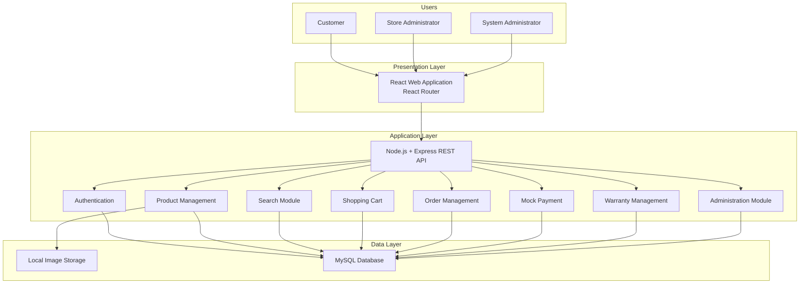
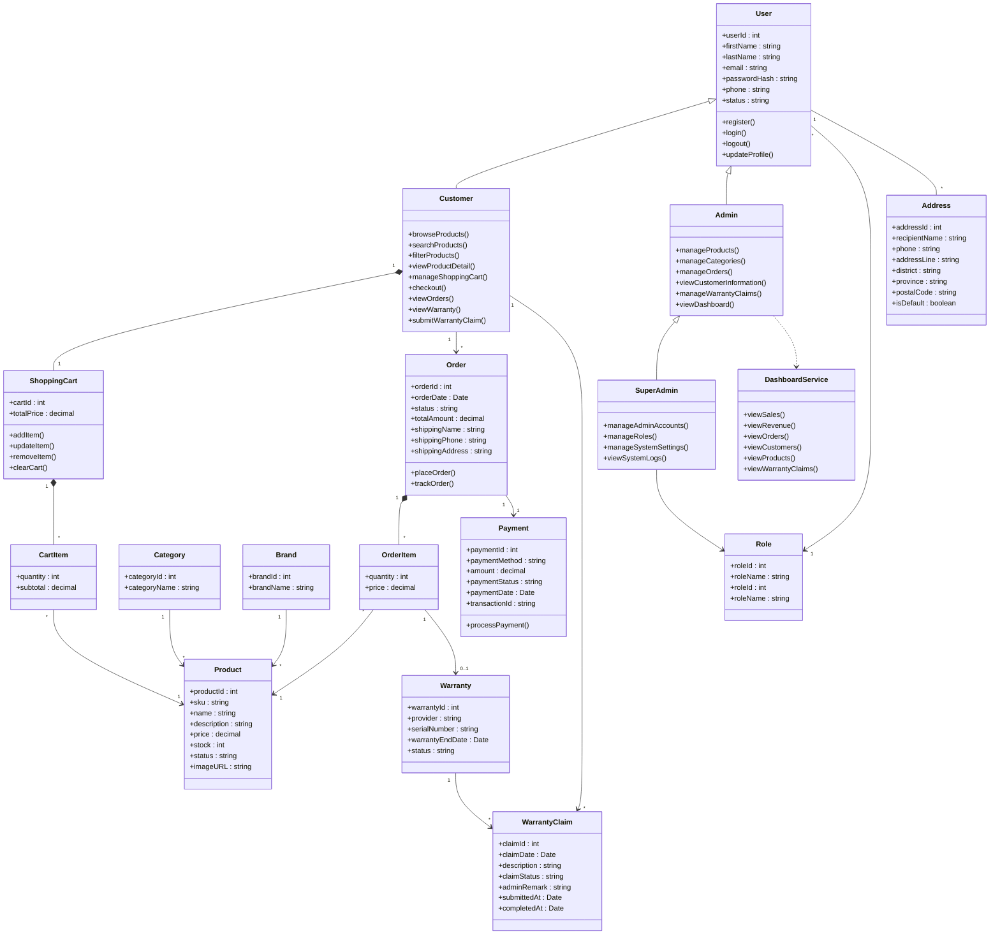
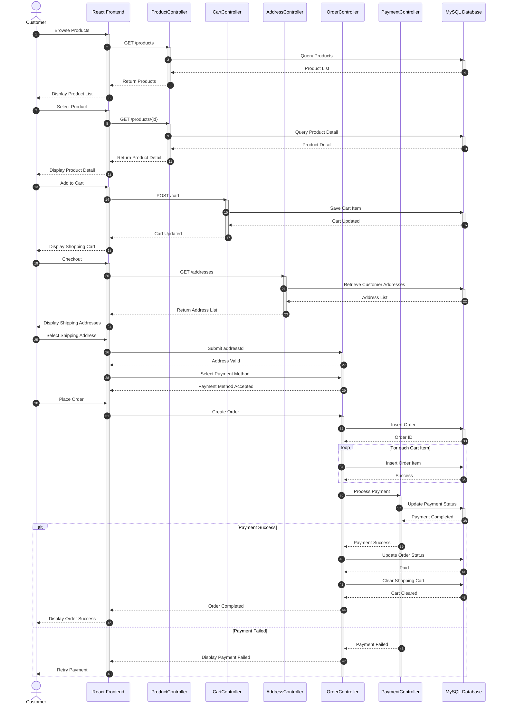
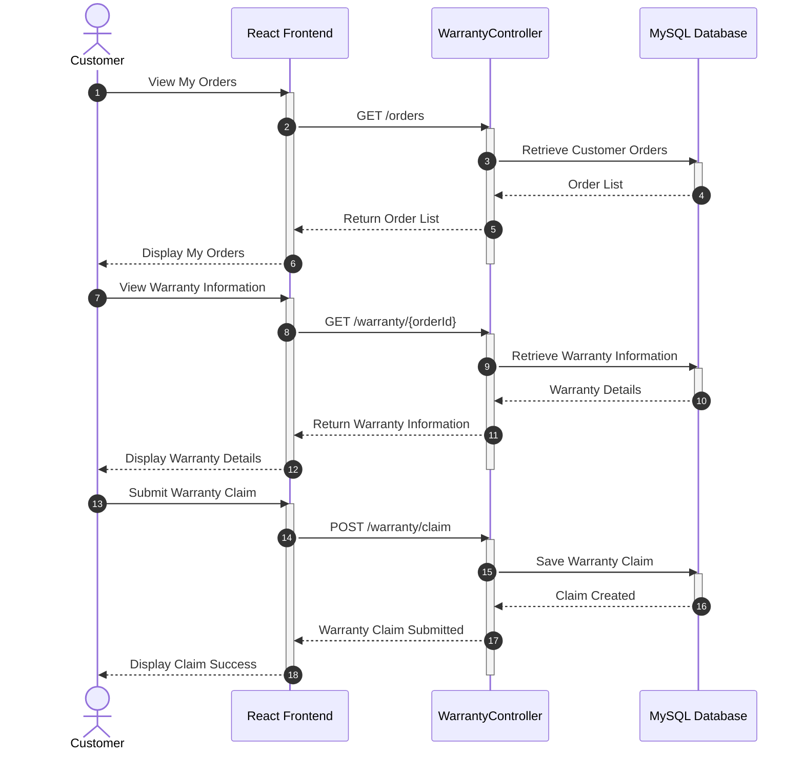
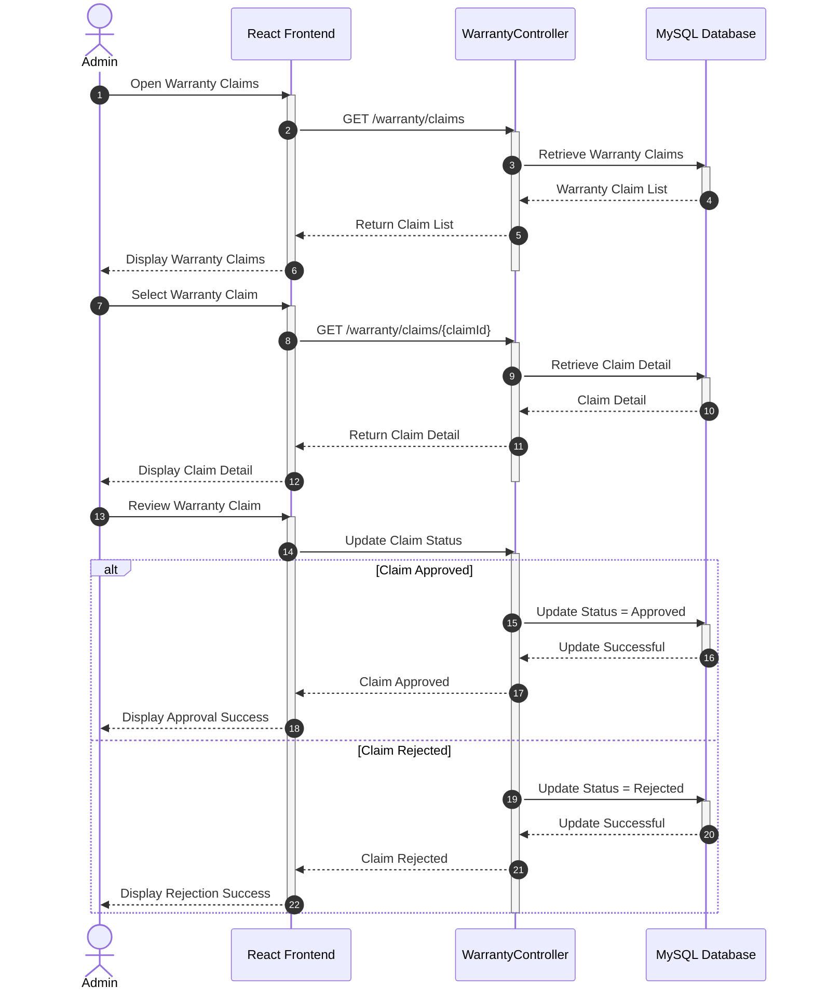
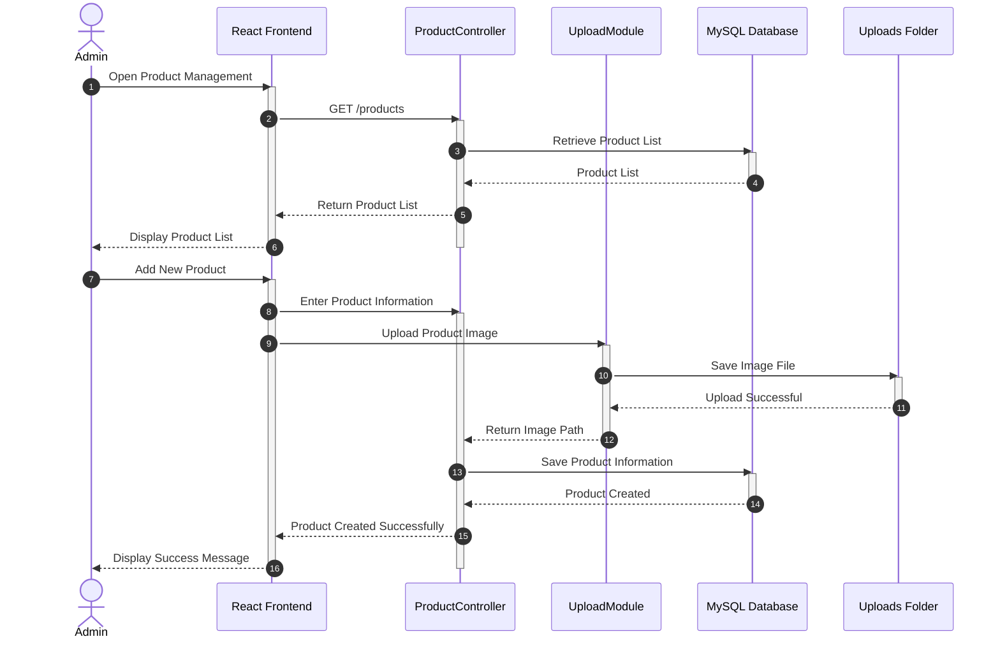
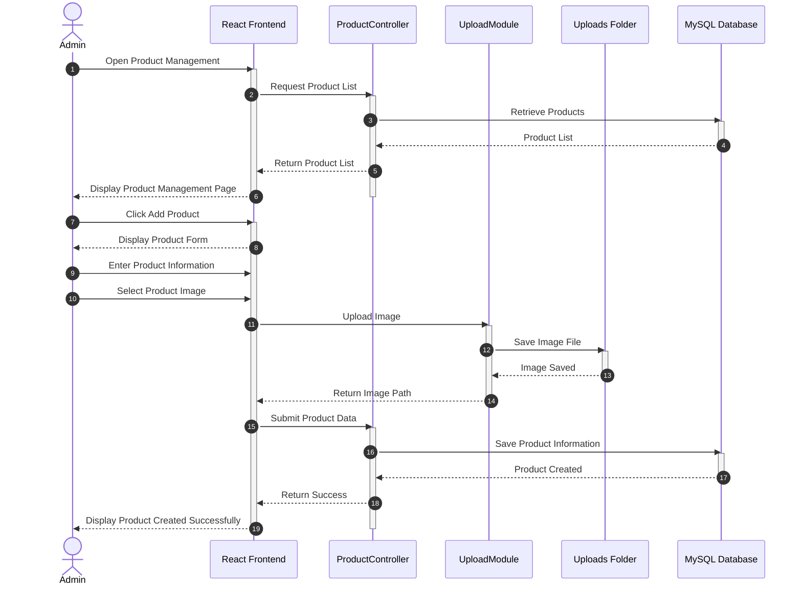

## 3.1 System Architecture

The system architecture illustrates the overall structure of the TechPulse E-Commerce System. The application follows a three-tier architecture consisting of the Presentation Layer, Application Layer, and Data Layer. Customers, administrators, and super administrators interact with the system through a web browser. The frontend communicates with the backend via RESTful APIs, while the backend processes business logic and manages data stored in the MySQL database. Product images are stored separately in the local upload storage and referenced by the database.



**Figure 3.1:** System Architecture of the TechPulse E-Commerce System.

### Description

The TechPulse E-Commerce System adopts a three-tier architecture consisting of the following layers:

- **Presentation Layer** provides the user interface developed using React.js. Customers, Store Administrators, and System Administrators access the system through a web browser.

- **Application Layer** is implemented using Node.js and Express.js. It contains the core business logic, including authentication, product management, product search, shopping cart, order processing, payment processing, warranty management, and administration functions.

- **Data Layer** consists of the MySQL database and local image storage. The MySQL database stores application data such as users, products, categories, orders, payments, and warranty claims, while uploaded product images are stored in the local upload directory and referenced by the database.

---

## 3.1 Class Diagram



---

## 3.3 Sequence Diagram

### 3.3.1 Customer Purchase Flow

The Customer Purchase Flow sequence diagram illustrates the complete purchasing process in the TechPulse E-Commerce System. The workflow begins when a customer browses and selects a product, adds it to the shopping cart, and proceeds to the checkout process. The customer then provides the shipping address, selects a payment method, and places the order. The system validates the order, processes the payment, updates the order status, and clears the shopping cart after a successful transaction. If the payment fails, the customer is notified and may retry the payment process.



---

### 3.3.2 Warranty Claim Flow (Customer)

The Warranty Claim Flow sequence diagram illustrates the process of submitting a warranty claim for a purchased product. The customer first views their order history and warranty information, then selects an eligible product and submits a warranty claim. The system validates the request, stores the warranty claim in the database, and returns a confirmation message indicating that the claim has been successfully submitted for administrator review.



---

### 3.3.3 Manage Warranty Claim Flow (Admin)

The Manage Warranty Claim Flow sequence diagram illustrates how administrators review and manage warranty claim requests submitted by customers. The administrator retrieves the list of warranty claims, reviews the detailed claim information, and determines whether the claim should be approved or rejected. The system updates the claim status in the database and returns the operation result, allowing the administrator to complete the warranty claim management process.



---

### 3.3.4 Admin Add Product Flow

The Admin Add Product Flow sequence diagram illustrates the process of adding a new product to the TechPulse E-Commerce System. The administrator opens the product management page, enters the product information, and uploads the product image. The image is stored in the local uploads folder, and the generated image path is associated with the product information before being saved in the database. After successful validation and storage, the system confirms that the product has been created successfully.



---

### 3.3.5 Admin Manage Order Flow

The Admin Manage Order Flow sequence diagram illustrates how administrators manage customer orders within the TechPulse E-Commerce System. The administrator retrieves the order list, views the details of a selected order, and updates its status based on the current order processing stage. The system validates the update request, stores the new order status in the database, and returns a confirmation message indicating that the order has been updated successfully.



---

## 3.4 Data Schema (JSON)

### Overview

The following JSON schemas represent the primary data entities used in the TechPulse E-Commerce System. The schemas are organized into logical modules based on the system architecture, making it easier to understand the relationship between business functions and stored data.

---

# 3.4.1 Identity Management

The Identity Management module stores user authentication, authorization, and shipping address information.

---

### Role

```json
{
  "roleId": 1,
  "roleName": "Customer",
  "description": "Standard customer account."
}
```

Represents a system role used for authorization and access control.

---

### User

```json
{
  "userId": 1,
  "roleId": 1,
  "firstName": "John",
  "lastName": "Doe",
  "email": "john@example.com",
  "passwordHash": "$2b$10$xxxxxxxx",
  "phone": "0812345678",
  "createdAt": "2026-07-14T10:00:00Z",
  "updatedAt": "2026-07-14T10:00:00Z"
}
```

Represents a registered user of the system.

---

### Address

```json
{
  "addressId": 1,
  "userId": 1,
  "recipientName": "John Doe",
  "phone": "0812345678",
  "address": "99 ถนนสุขุมวิท",
  "district": "คลองเตย",
  "province": "Bangkok",
  "postalCode": "10110",
  "isDefault": true,
  "createdAt": "2026-07-14T10:00:00Z",
  "updatedAt": "2026-07-14T10:00:00Z"
}
```

Represents a customer's shipping address.

---

# 3.4.2 Product Catalog Management

The Product Catalog module stores information related to product categories, brands, products, and product images.

---

### Category

```json
{
  "categoryId": 1,
  "categoryName": "Notebook"
}
```

Represents a product category.

---

### Brand

```json
{
  "brandId": 1,
  "brandName": "ASUS"
}
```

Represents a product brand.

---

### Product

```json
{
  "productId": 101,
  "categoryId": 1,
  "brandId": 1,
  "productName": "ASUS ROG Strix G16",
  "description": "Gaming Notebook",
  "price": 45990,
  "stock": 12,
  "warrantyProvider": "ASUS Thailand",
  "status": "Available",
  "createdAt": "2026-07-14T10:00:00Z",
  "updatedAt": "2026-07-14T10:00:00Z"
}
```

Represents a product available in the system.

---

### Product Image

```json
{
  "imageId": 1,
  "productId": 101,
  "imageUrl": "/uploads/products/g16-front.jpg",
  "isPrimary": true
}
```

Represents a product image.

---

# 3.4.3 Shopping Cart Management

The Shopping Cart module stores customer shopping carts and selected products before checkout.

---

### Shopping Cart

```json
{
  "cartId": 1,
  "userId": 1,
  "createdAt": "2026-07-14T10:00:00Z",
  "updatedAt": "2026-07-14T10:00:00Z"
}
```

Represents a customer's shopping cart.

---

### Cart Item

```json
{
  "cartItemId": 1,
  "cartId": 1,
  "productId": 101,
  "quantity": 2
}
```

Represents a product stored in the shopping cart.

---

# 3.4.4 Order & Payment Management

The Order Management module stores customer orders, purchased products, and payment information.

---

### Order

```json
{
  "orderId": 1001,
  "userId": 1,
  "addressId": 1,
  "shippingName": "John Doe",
  "shippingPhone": "0812345678",
  "shippingAddress": "99 ถนนสุขุมวิท",
  "shippingPostalCode": "10110",
  "totalAmount": 91980,
  "orderStatus": "Paid",
  "orderDate": "2026-07-14T10:00:00Z"
}
```

Represents a customer order.

---

### Order Item

```json
{
  "orderItemId": 1,
  "orderId": 1001,
  "productId": 101,
  "quantity": 2,
  "unitPrice": 45990
}
```

Represents an individual purchased product within an order.

---

### Payment

```json
{
  "paymentId": 1,
  "orderId": 1001,
  "paymentMethod": "PromptPay",
  "amount": 91980,
  "paymentStatus": "Completed",
  "paymentDate": "2026-07-14T10:00:00Z"
}
```

Represents payment information for an order.

---

# 3.4.5 Warranty Management

The Warranty module stores warranty information and customer warranty claim requests.

---

### Warranty

```json
{
  "warrantyId": 1,
  "orderItemId": 1,
  "serialNumber": "ASUS-2026-000001",
  "expiryDate": "2028-07-14",
  "warrantyProvider": "ASUS Thailand",
  "warrantyStatus": "Active"
}
```

Represents warranty information for a purchased product.

---

### Warranty Claim

```json
{
  "claimId": 1,
  "warrantyId": 1,
  "userId": 1,
  "description": "Screen flickering issue",
  "claimStatus": "Pending",
  "claimDate": "2026-08-01T14:30:00Z"
}
```

Represents a customer's warranty claim request.